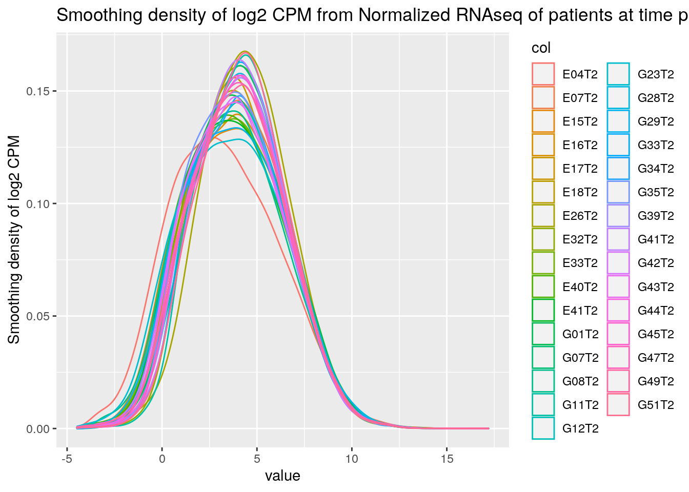
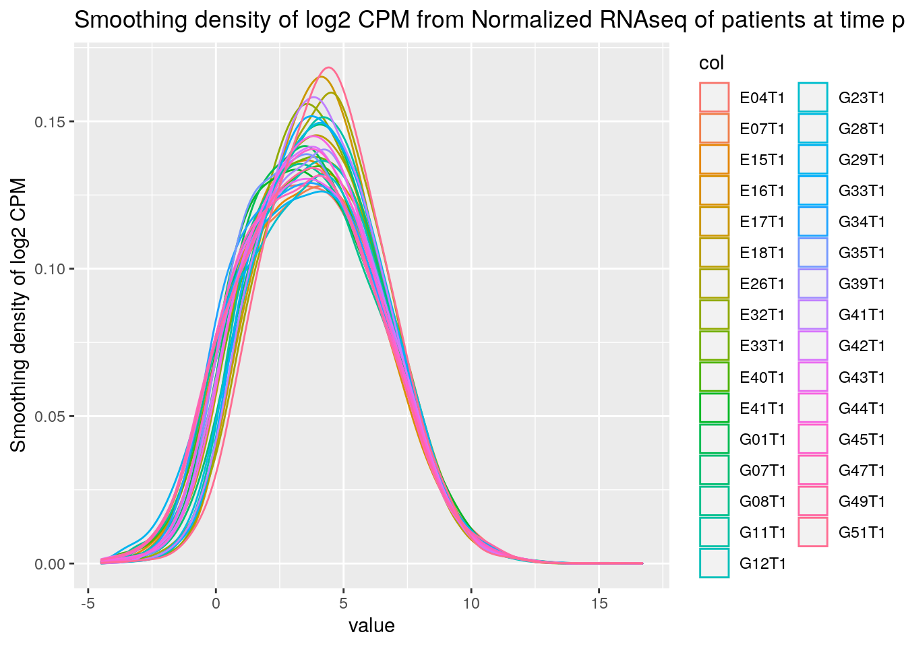

## Introduction
Septic shock is one of the most common adverse events to occur to patients in hospitals (1). This disease, resultant from infection, is often deadly, and is prevalent in both developing and developed countries. Due to a variety of patient-specific factors such as antibiotic resistance, sepsis can be difficult to treat. This leads to the question of whether gene expression differences can be seen in patients that respond well to sepsis treatments, compared to those that do not.

The dataset selected for this assignment consists of 31 sepsis patients that underwent whole blood RNA sequencing. Of these 31 patients, 17 responded to treatment (R), and 14 did not (NR). The sequencing was performed at two time points: upon ICU admission (T1), and 48h after ICU admission (T2). After being admitted to the ICU, the patients received hemodynamic therapy as treatment for sepsis (2).

The experimental conditions of interest are whether the patients are Responders or Non-Responders, as we are interested in evaluating gene expression differences and how different treatments may be appropriate based on a patient's gene expression.



Figure 1: Density plots of normalized expression of all patients at T1 and T2.

```{r setup, include=FALSE}
knitr::opts_chunk$set(echo = TRUE)
suppressWarnings({if (!requireNamespace("BiocManager", quietly = TRUE))
    install.packages("BiocManager")
if (!requireNamespace("GEOmetadb", quietly = TRUE))
    BiocManager::install("GEOmetadb")
if (!requireNamespace("limma", quietly = TRUE))
    BiocManager::install("limma")
if (!requireNamespace("AnnotationDbi", quietly = TRUE))
    BiocManager::install("AnnotationDbi")
if (!requireNamespace("org.Hs.eg.db", quietly = TRUE))
    BiocManager::install("org.Hs.eg.db")
if (!requireNamespace("edgeR", quietly = TRUE))
    BiocManager::install("edgeR")
if (!requireNamespace("readxl", quietly = TRUE))
    BiocManager::install("readxl")
if (!requireNamespace("RColorBrewer", quietly = TRUE))
    install.packages("RColorBrewer")
if (!requireNamespace("tidyverse", quietly = TRUE))
    install.packages("tidyverse")
if (!requireNamespace("ggplot2", quietly = TRUE))
    install.packages("ggplot2")
if (!requireNamespace("dplyr", quietly = TRUE))
    install.packages("dplyr")
if (!requireNamespace("gprofiler2", quietly = TRUE))
    install.packages("gprofiler2")
if (!requireNamespace("ComplexHeatmap", quietly = TRUE))
    install.packages("ComplexHeatmap")})
suppressPackageStartupMessages({
  library(tidyverse)
  library(edgeR)
  library(org.Hs.eg.db)
  library(GEOmetadb)
  library(RColorBrewer)
  library(ggplot2)
  library(readxl)
  library(dplyr)
  library(AnnotationDbi)
  library(limma)
})
# read in SRA run table 
expDesign <- read.delim("./SraRunTable.txt", sep = ",")

# create groups matrix:
expGroups <- as.data.frame(cbind(response = expDesign$clinical_classification, timepoint=expDesign$timepoint, patient=expDesign$Patient))

# Some experimental design information was incorrectly entered in the downloaded metadata file, so this information was manually entered based on paper figures:
expGroups <- as.data.frame(rbind(expGroups, c("R", "T1", "E32"), c("R", "T1", "G28"),c("R", "T1", "G45"), c("R", "T2", "E32"),c("R", "T2", "G28"),c("R", "T2", "G45"), c("NR", "T1", "G01"), c("NR", "T2", "G01"), c("R", "T1", "G07"), c("R", "T2", "G07"), c("NR", "T1", "G08"), c("NR", "T2", "G08")))

# metadata included some duplicates
expGroups <- distinct(expGroups)
sampleNames <- paste(expGroups$patient, expGroups$timepoint, sep="")
rownames(expGroups) <- sampleNames

#split groups matrix into day 1 and day 2:
expGroups <- as_tibble(t(expGroups))
expGroups1 <- expGroups %>%
  dplyr::select(ends_with("T1"))
expGroups2 <- expGroups %>%
  dplyr::select(ends_with("T2"))

expGroups1 <- t(expGroups1)
colnames(expGroups1) <- c("response", "timepoint", "patient")
expGroups1 <- as.data.frame(expGroups1)
expGroups1$name <- rownames(expGroups1)

expGroups2 <- t(expGroups2)
colnames(expGroups2) <- c("response", "timepoint", "patient")
expGroups2 <- as.data.frame(expGroups2)
expGroups2$name <- rownames(expGroups2)
```

## Differential Gene Expression

Read in normalized data:
```{r}
tp1 <- read.csv("normalizedCountsTimePoint1.csv")
tp2 <- read.csv("normalizedCountsTimePoint2.csv")

rownames(tp1) <- tp1$X
tp1$X <- NULL

rownames(tp2) <- tp2$X
tp2$X <- NULL
```

Create the differential expression model:
```{r}
model_design1 <- model.matrix(~ expGroups1$response)
exprMat1 <- as.matrix(tp1)
rownames(exprMat1) <- rownames(tp1)
colnames(exprMat1) <- colnames(tp1)
minSet1 <- ExpressionSet(assayData=exprMat1)

model_design2 <- model.matrix(~  expGroups2$response)
exprMat2 <- as.matrix(tp2)
rownames(exprMat2) <- rownames(tp2)
colnames(exprMat2) <- colnames(tp2)
minSet2 <- ExpressionSet(assayData=exprMat2)

fit1 <- limma::lmFit(minSet1, model_design1)
fit2 <- limma::lmFit(minSet2, model_design2)

bayes1 <- eBayes(fit1, trend=TRUE)
bayes2 <- eBayes(fit2, trend=TRUE)

topfit1 <- topTable(bayes1, 
                   coef=ncol(model_design1),
                   adjust.method = "BH",
                   number = nrow(exprMat1))

output_hits1 <- merge(rownames(tp1),
                     topfit1,
                     by.y=0,by.x=1,
                     all.y=TRUE)
#sort by pvalue
output_hits1 <- output_hits1[order(output_hits1$P.Value),]
knitr::kable(output_hits1[1:10,],type="html",row.names = FALSE)

topfit2 <- topTable(bayes2, 
                   coef=ncol(model_design1),
                   adjust.method = "BH",
                   number = nrow(exprMat2))

output_hits2 <- merge(rownames(tp2),
                     topfit2,
                     by.y=0,by.x=1,
                     all.y=TRUE)
#sort by pvalue
output_hits2 <- output_hits2[order(output_hits2$P.Value),]
knitr::kable(output_hits2[1:10,],type="html",row.names = FALSE)
```

1. After calculating p-values for the genes in my expression set, I found that there were 379 DE genes in the T1 data, and 1774 DE genes in the T1 data. This is using a p-value of 0.05, which was selected because it allowed for a reasonable number of genes to be "significant" at each time point. A more lenient threshold would result in too many genes (statistically less rigorous, and difficult to work with), and a more stringent threshold may result in fewer significant pathways being found downstream.

2. To correct my p-values, I used the Benjamini-Hochberg method, as this was what was used by the authors of the original paper as well. This method is known to be less stringent than the Bonferroni method, which I think is desirable for this dataset as the nuances between the R and NR groups may be relatively small.
```{r}
length(which(output_hits1$P.Value < 0.05))
length(which(output_hits2$P.Value < 0.05))

length(which(output_hits1$adj.P.Val < 0.05))
length(which(output_hits2$adj.P.Val < 0.05))
```
Unfortunately, after correcting the P-values, none of the genes pass correction.

3. Volcano plot:
```{r, fig.cap="Figure 2: Volcano plots of DE genes"}
tp1MA <- tp1 %>%
  rownames_to_column("gene") %>%
  pivot_longer(cols=colnames(tp1), names_to="name", values_to="expr")%>%
  merge(expGroups1, by="name") %>%
  merge(output_hits1, by.x="gene", by.y="x") %>%
  mutate(Signif=if_else(P.Value < 0.05, "Sig", "Insig")) %>%
  mutate(Reg = case_when((P.Value < 0.05 & logFC < 0)~"Down",
         (P.Value < 0.05 & logFC > 0)~"Up",
         (P.Value > 0.05 & logFC > 0)~"Not Significant",
         (P.Value > 0.05 & logFC < 0)~"Not Significant"))


ggplot(as.data.frame(tp1MA), aes(x=logFC, y=-log10(P.Value), colour=as.factor(Reg)))+
  geom_point()+
  ggtitle("Volcano Plot for T1 Expression")
```
```{r}
tp2MA <- tp2 %>%
  rownames_to_column("gene") %>%
  pivot_longer(cols=colnames(tp2), names_to="name", values_to="expr")%>%
  merge(expGroups2, by="name") %>%
  merge(output_hits2, by.x="gene", by.y="x") %>%
  mutate(Signif=if_else(P.Value < 0.05, "Sig", "Insig")) %>%
  mutate(Reg = case_when((P.Value < 0.05 & logFC < 0)~"Down",
         (P.Value < 0.05 & logFC > 0)~"Up",
         (P.Value > 0.05 & logFC > 0)~"Not Significant",
         (P.Value > 0.05 & logFC < 0)~"Not Significant"))


ggplot(as.data.frame(tp2MA), aes(x=logFC, y=-log10(P.Value), colour=as.factor(Reg)))+
  geom_point()+
  ggtitle("Volcano Plot for T2 Expression")
```
\newline
4. Heatmaps of top hits:
```{r}
suppressPackageStartupMessages(library(ComplexHeatmap)) 

signifGenes <- output_hits1$x[which(output_hits1$P.Value < 0.05)]
signifExpr1 <- tp1[which(rownames(tp1) %in% signifGenes),]

signifExpr1 <- t(scale(t(signifExpr1)))
dend1 = cluster_between_groups(signifExpr1, expGroups1$response)
dend_col = c("R" = 3, "NR" = 2)
hm1 <- ComplexHeatmap::Heatmap(as.matrix(signifExpr1), 
                        cluster_columns=dend1, 
                        top_annotation=
                      HeatmapAnnotation(response=as.factor(expGroups1$response), col = list(response = dend_col)),
                      row_names_gp = grid::gpar(fontsize = 3),
                      column_names_gp = grid::gpar(fontsize = 5),
                      name="Before treatment")

signifGenes2 <- output_hits2$x[which(output_hits2$P.Value < 0.05)]
signifExpr2 <- tp2[which(rownames(tp2) %in% signifGenes2),]

signifExpr2 <- t(scale(t(signifExpr2)))
dend2 = cluster_between_groups(signifExpr2, expGroups2$response)
dend_col = c("R" = 3, "NR" = 2)
hm2 <- ComplexHeatmap::Heatmap(as.matrix(signifExpr2), 
                        cluster_columns=dend2, 
                        top_annotation=
                      HeatmapAnnotation(response=as.factor(expGroups2$response), col = list(response = dend_col)),
                      row_names_gp = grid::gpar(fontsize = 3),
                      column_names_gp = grid::gpar(fontsize = 5),
                      name="After treatment")


```

```{r, fig.cap="Figure 3A: Heatmaps of expression values for DE genes across all patients at T1"}
hm1
```

```{r, fig.cap="Figure 3B: Heatmaps of expression values for DE genes across all patients at T2"}
hm2 
```

\newline
In the heatmaps above, I deliberately clustered together the experimental groups (R and NR) in order to see the similarities within the groups. However, Since there does seem to be more intra-group similarity than inter-group similarity, it is likely that the experiment groups would cluster together without deliberately specifying so.

##  Thresholded over-representation analysis

Create lists of up and downregulated genes:
```{r}
tp1Sig <- output_hits1[which(output_hits1$P.Value < 0.05),]
tp1Upreg <- tp1Sig[which(tp1Sig$logFC > 0),]
tp1Downreg <- tp1Sig[which(tp1Sig$logFC < 0),]

tp2Sig <- output_hits1[which(output_hits2$P.Value < 0.05),]
tp2Upreg <- tp2Sig[which(tp2Sig$logFC > 0),]
tp2Downreg <- tp2Sig[which(tp2Sig$logFC < 0),]
```

Use g:profiler for ORA:
```{r pressure, message=FALSE, warning=FALSE, fig.cap="Figure 4A: Manhattan Plot of ORA results for all DE genes at T1"}
suppressPackageStartupMessages(library(gprofiler2))

gostrestp1 <- gost(tp1Sig$x, sources=c("GO:BP", "GO:MF", "GO:CC", "KEGG"))
gostrestp1Up <- gost(tp1Upreg$x, sources=c("GO:BP", "GO:MF", "GO:CC", "KEGG"))
gostrestp1Down <- gost(tp1Downreg$x, sources=c("GO:BP", "GO:MF", "GO:CC", "KEGG"))

gostrestp2 <- gost(tp2Sig$x, sources=c("GO:BP", "GO:MF", "GO:CC", "KEGG"))
gostrestp2Up <- gost(tp2Upreg$x, sources=c("GO:BP", "GO:MF", "GO:CC", "KEGG"))
gostrestp2Down <- gost(tp2Downreg$x, sources=c("GO:BP", "GO:MF", "GO:CC", "KEGG"))

gostplot(gostrestp1)
```

```{r, fig.cap="Figure 4B: Manhattan Plot of ORA results for all DE genes at T2"}
gostplot(gostrestp2)
```

```{r, fig.cap="Figure 4C: Manhattan Plots of ORA results for upregulated genes at T1"}
gostplot(gostrestp1Up)

```

```{r, fig.cap="Figure 4D: Manhattan Plots of ORA results for downregulated genes at T1"}
gostplot(gostrestp1Down)
```


```{r, fig.cap="Figure 4E: Manhattan Plots of ORA results for upregulated genes at T2"}
gostplot(gostrestp2Up)

```

```{r, fig.cap="Figure 4F: Manhattan Plots of ORA results for downregulated genes at T2"}
gostplot(gostrestp2Down)
```


```{r, fig.cap="Figure 4G: Manhattan Plots of ORA results for T1, using threshold of 0.001"}
gostrestp1 <- gost(tp1Sig$x, 
                   sources=c("GO:BP", "GO:MF", "GO:CC", "KEGG"), 
                   user_threshold = 0.001)

gostrestp2 <- gost(tp2Sig$x, 
                   sources=c("GO:BP", "GO:MF", "GO:CC", "KEGG"), 
                   user_threshold = 0.001)
gostplot(gostrestp1)

```

```{r, fig.cap="Figure 4H: Manhattan Plots of ORA results T2, using threshold of 0.001"}
gostplot(gostrestp2)
```


1. For my over representation analysis, I chose to use the gprofiler2 R package. I found g:Profiler very convenient to use in the journal assignment. As well, I thought that g:profiler was extremely thorough as it allows your to compare your gene list to multiple different databases at once. You can also adjust your significance thresholds.

2. The annotation sources used in this analysis are GO: Molecular Functions, GO: Cellular Components, GO: Biological Pathways, and KEGG. These were selected because the authors of the original paper used a tool called ClueGO, which is a plugin for Cytoscape (Bindea et al., 2009). Since Cytoscape was not used in my assignment, I instead used the datasets that make up ClueGO directly, which are GO and KEGG. I believe g:profiler uses the most up to date versions of GO and KEGG, as the g:profiler website was last updated in February of this year. The R package is supposed to return the same results as using the website, so the results above should also be using the most recent versions of the annotation sources.

3. With the default thresholding values from gost (p < 0.05), 49 pathways were returned for the T1 gene list, and 278 pathways were returned for the T2 gene list. The authors used a thresholding value of 0.001. When this was applied in my assignment, 8 pathways were returned for the T1 gene list, and 166 pathways were returned for the T2 gene list. Albeit, this threshold was used on a slightly different method (ClueGO from Cytoscape), and the authors had different upstream pre-processing than what was done in this assignment.

4. For each of the two time points, the ORA was run again for the up- and downregulated gene sets. At T1, none of the pathways were above the threshold when considering the entire set of DE genes. The same is true when only considering up- and downregulated genes individually. At T2, when considering the entire gene list, there are many pathways that are above the threshold. However, the downregulated genes have much fewer pathways that pass the threshold. There are only two, which are protein binding and cytosol related pathways. The pathways that pass the threshold when only considering the up- or downregulated genes seem to be subsets of the pathways that pass the threshold when considering all genes. The results may be different in these cases because the background genes that are being considered are different in each set.

## Interpretation
1. In the original paper, the authors found that there were no significantly DE genes in the R and NR groups. However, in my analysis, I was able to find about 300 significnatly DE genes between the two groups. It is important to note that my pre-processing steps such as normalization may have differed from that of the author's, as they did not disclose their full methods in the paper or their supplementary methods. 

As well, the authors specified a slightly different model than mine. They split the data into two groups based on response to treatment (R vs NR), and specified the model (counts ~ patient + timepoint) for each group. In my analysis, I split the data into two groups based on time point, and specified the model (counts ~ response) for each timepoint. Although it is difficult to compare the two approaches, it is interesting to note that both my analysis and the paper found more significantly up/downregulated pathways at the second time point. Moreover, the heatmap plotted by the authors for the DE genes they found followed an extremely similar pattern as my heatmaps. This suggests that although the two analyses had different results, they may have found the same overall patterns in the data.

However, one issue with my analysis is that the pathways that it found to be significant are not the same as those found by the authors. The authors found immune-related pathways to be significant, which were not found in my analyses. The pathways found to be significant in my assignment were related to cellular metabolic processes and cell death. Again, this may be due to their use of Cytoscape, as their method seems to perform grouping of terms, which was not done in my assignment. It is also possible that the GO and KEGG datasets have been updated since the paper was published.

2. One of the upregulated pathways at T2 is biosynthetic processes. This suggests that biosynthetic processes are upregulated in R patients after receiving treatment. This is supported by literature as one of the effects of septic shock is protein catabolism (Englert and Rogers, 2016). If the R patients have their biosynthetic process pathways upregulated, this indicates that they are likely recovering from septic shock. Another upregulated pathway at T2 is organonitrogen substance biosynthetic process. Due to protein breakdown during septic shock, patients generally exhibit a negative nitrogen balance (Englert and Rogers, 2016). If organonitrogen production is upregulated in R patients, this further indicates that they are recovering, which is in line with the original study's designation.

## Discussion
One area of interest in this assignment is the specification of the linear model. Since I was interested in exploring the differences in expression between the R and NR groups, I split the dataset into two based on the time point at which the data was collected. Then, I specified my model as (counts ~ response). The patient variable was not included in the model. This is because including the patient variable in the linear model from limma resulted in NA coefficients for one of the variables in the model. This suggests that the response variable may be collinear with the patient variable, and thus would be redundant to include both.

## References
1. Sepsis. (2022). Retrieved 15 February 2022, from https://www.who.int/news-room/fact-sheets/detail/sepsis
2. Barcella, M., Bollen Pinto, B., Braga, D., D’Avila, F., Tagliaferri, F., & Cazalis, M. et al. (2018). Identification of a transcriptome profile associated with improvement of organ function in septic shock patients after early supportive therapy. Critical Care, 22(1). doi: 10.1186/s13054-018-2242-3
3.Zhu Y, Davis S, Stephens R, Meltzer PS, Chen Y. GEOmetadb: powerful alternative search engine for the Gene Expression Omnibus. Bioinformatics. 2008 Dec 1;24(23):2798-800. doi:10.1093/bioinformatics/btn520. Epub 2008 Oct 7. PubMed PMID: 18842599; PubMed Central PMCID:PMC2639278.
4. Ritchie, M.E., Phipson, B., Wu, D., Hu, Y., Law, C.W., Shi, W., and Smyth, G.K. (2015). limma powers differential expression analyses for RNA-sequencing and microarray studies. Nucleic Acids Research 43(7), e47.
5. Hervé Pagès, Marc Carlson, Seth Falcon and Nianhua Li (2020). AnnotationDbi: Manipulation of SQLite-based annotations in Bioconductor. R package version 1.52.0. https://bioconductor.org/packages/AnnotationDbi
6. Marc Carlson (2020). org.Hs.eg.db: Genome wide annotation for Human. R package version 3.12.0.
7. Robinson MD, McCarthy DJ and Smyth GK (2010). edgeR: a Bioconductor package for differential expression analysis of digital gene expression data. Bioinformatics 26, 139-140
8. Hadley Wickham and Jennifer Bryan (2019). readxl: Read Excel Files. R package version 1.3.1. https://CRAN.R-project.org/package=readxl
9. Erich Neuwirth (2014). RColorBrewer: ColorBrewer Palettes. R package version 1.1-2. https://CRAN.R-project.org/package=RColorBrewer
10. Wickham et al., (2019). Welcome to the tidyverse. Journal of Open Source Software, 4(43), 1686, https://doi.org/10.21105/joss.01686
11. H. Wickham. ggplot2: Elegant Graphics for Data Analysis. Springer-Verlag New York, 2016.
12. Hadley Wickham, Romain François, Lionel Henry and Kirill Müller (2022). dplyr: A Grammar of Data Manipulation. R package version 1.0.8.
https://CRAN.R-project.org/package=dplyr
13. Robinson, M., & Oshlack, A. (2010). A scaling normalization method for differential expression analysis of RNA-seq data. Genome Biology, 11(3), R25. doi: 10.1186/gb-2010-11-3-r25
14. Englert, J. A., & Rogers, A. J. (2016). Metabolism, Metabolomics, and Nutritional Support of Patients with Sepsis. Clinics in chest medicine, 37(2), 321–331. https://doi.org/10.1016/j.ccm.2016.01.011
15. Bindea, G., Mlecnik, B., Hackl, H., Charoentong, P., Tosolini, M., Kirilovsky, A., Fridman, W. H., Pagès, F., Trajanoski, Z., & Galon, J. (2009). ClueGO: a Cytoscape plug-in to decipher functionally grouped gene ontology and pathway annotation networks. Bioinformatics (Oxford, England), 25(8), 1091–1093. https://doi.org/10.1093/bioinformatics/btp101
16. Kolberg L, Raudvere U, Kuzmin I, Vilo J, Peterson H (2020). “gprofiler2- an R
package for gene list functional enrichment analysis and namespace conversion
toolset g:Profiler.” F1000Research, 9 (ELIXIR)(709). R package version
0.2.1.