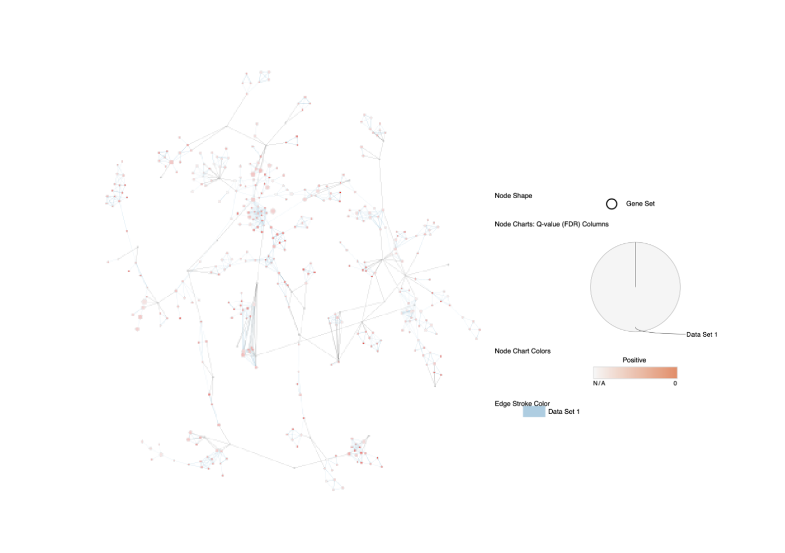

```{r setup, include=FALSE}
knitr::opts_chunk$set(echo = TRUE)
suppressWarnings({if (!requireNamespace("BiocManager", quietly = TRUE))
    install.packages("BiocManager")
if (!requireNamespace("tidyverse", quietly = TRUE))
    install.packages("tidyverse")
if (!requireNamespace("ggplot2", quietly = TRUE))
    install.packages("ggplot2")
if (!requireNamespace("dplyr", quietly = TRUE))
    install.packages("dplyr")
if (!requireNamespace("RCy3", quietly = TRUE))
    BiocManager::install("RCy3")
  if (!requireNamespace("fgsea", quietly = TRUE))
    BiocManager::install("fgsea")})
suppressPackageStartupMessages({
  library(tidyverse)
  library(ggplot2)
  library(dplyr)
  library(fgsea)
})
```
# Introduction
Septic shock is one of the most common adverse events to occur to patients in hospitals (1). This disease, resultant from infection, is often deadly, and is prevalent in both developing and developed countries. Due to a variety of patient-specific factors such as antibiotic resistance, sepsis can be difficult to treat. This leads to the question of whether gene expression differences can be seen in patients that respond well to sepsis treatments, compared to those that do not.

The dataset selected for this assignment consists of 31 sepsis patients that underwent whole blood RNA sequencing. Of these 31 patients, 17 responded to treatment (R), and 14 did not (NR). The sequencing was performed at two time points: upon ICU admission (T1), and 48h after ICU admission (T2). After being admitted to the ICU, the patients received hemodynamic therapy as treatment for sepsis (2). The dataset was downloaded from GEO with the accession number GSE110487.

The experimental conditions of interest are whether the patients are Responders or Non-Responders, as we are interested in evaluating gene expression differences and how different treatments may be appropriate based on a patient's gene expression.

In Assignment 1, we performed data normalization in order to decrease variation between patients and to make the data easier to work with in downstream differential expression analyses. 


# Non-thresholded Gene set Enrichment Analysis
```{r}
T1Ranked <- readRDS("T1rankedGenes.RDS")
T2Ranked <- readRDS("T2rankedGenes.RDS")

T1Ranked <- T1Ranked %>%
  as_tibble()%>%
  mutate(rank = sign(logFC)*P.Value)%>%
  dplyr::select(x, rank)

T2Ranked <- T2Ranked %>%
  as_tibble()%>%
  mutate(rank = sign(logFC)*P.Value)%>%
  dplyr::select(x, rank)

pathways <- fgsea::gmtPathways("Human_GOBP_AllPathways_no_GO_iea_March_01_2021_symbol.gmt")

T1gsea <- fgsea::fgsea(pathways=pathways, stats=deframe(T1Ranked),maxSize=200, minSize=15, nperm=1000)
T2gsea <- fgsea::fgsea(pathways=pathways, stats=deframe(T2Ranked),maxSize=200, minSize=15, nperm=1000)

T1resTidy <- T1gsea %>%
  as_tibble() %>%
  arrange(desc(NES))

T2resTidy <- T2gsea %>%
  as_tibble() %>%
  arrange(desc(NES))

knitr::kable(head(T1resTidy[,-ncol(T1resTidy)]))
knitr::kable(head(T1resTidy[,-ncol(T2resTidy)]))
```
1. For my gene set enrichment analysis, I used the `fgsea` function from the `fgsea` package, which performs GSEA in an optimized way so that more permutations can be computed in less time. I used the March 2021 genesets from the Bader Lab, because it includes all of the human pathways from GO:BP, which is suitable for my data.

2. Based on the enrichment results at T1, the majority of the top 5 pathways are involved with translation elongation. Since at T1 the patients have not been treated for sepsis, these pathways are in agreement with the disease states because translation elongation factors have been found to facilitate virus replication (https://www.ncbi.nlm.nih.gov/pmc/articles/PMC3668672/). At T2, a significantly upregulated pathway is the hallmark interferon alpha response. This indicates that after receiving sepsis treatment, the patients are able to initiate an immune response and are beginning to recover. My results for Assignment 2 were slightly different from the pathways above. Namely, for T1, my Assignment 2 results showed cellular metabolic processes and cell death being upregulated rather than translation elongation. However, I don't think that these results are necessarily in disagreement because they both align with the symptoms of septic shock. At T2, my Assignment 2 results showed biosynthetic processes as being upregulated, whereas the GSEA results show immune response. Again, despite the pathways being different, I think these results both match the experiment setup. However, I think it is difficult to directly compare the two sets of results because different genesets were used for the two assignments. Thus, it is possible that some pathways were different simply because they were not included in the other analysis' geneset.
```{r}
write_tsv(T1resTidy, "T1GSEARes.txt")
write_tsv(T2resTidy, "T2GSEARes.txt")
write_tsv(T1Ranked, "T1Ranks.rnk")
write_tsv(T2Ranked, "T2Ranks.rnk")
write_tsv(T1Ranked, "T1Ranks.txt")
write_tsv(T2Ranked, "T2Ranks.txt")
```

# Visualize your Gene set Enrichment Analysis in Cytoscape
1. Using the Generic method in Enrichment Map and a FDR q-value cutoff of 0.01, graphs were created for T1 and T2 data. At T1, there are 1938 nodes and 5434 edges in the graph:


At T2, there were 1066 nodes and 3067 edges:


2. Both of the networks were annotated using AutoAnnotate, with a maximum of 50 annotations in order to make the graphs more readable. The label column used was GS_DESCR.
3. Publication-ready figure for annotated T1 network: 


 
 
Publication-ready figure for annotated T2 network: 


4. After using "Collapse All" from AutoAnnotate:



Based on the collapsed network, there are several major themes in the T1 data.


The above two images represent the upregulation of glycosylation and bacterial defense. These definitely fit with the model as sepsis is a form of bacterial infection. At T1, it is expected to see that all patients are exhibiting a response to the infection because they have not received any sort of sepsis treatment. The glycosylation theme is expected as well because glycan interactions have been identified in many infectious diseases (6). 


Based on the collapsed network, there are also several major themes in the T2 data:


The above two images represent the organonitrogen and protein synthesis themes. One of the symptoms of sepsis is protein catabolism (4). Thus, seeing upregulation at T2 after receiving sepsis treatment is expected, as it means that patients are recovering and are now synthesizing proteins to replaced those that were lost while sick. Organonitrogen compound production is also upregulated based on the theme network, and this is expected because protein catabolism during sepsis can lead to a negative nitrogen balance. So once patients receive treatment and begin to recover during T2, we expect to see that organonitrogen synthesis pathways are upregulated.

# Interpretation and Detailed View of Results
1. In the original study, the authors set up a model that was slightly different from mine. Rather than creating networks for the pathways at T1 and T2, the authors created networks for the two experimental groups, R and NR. Thus, it is difficult to compare my results with theirs. However, in their R group, they did find a significant pathway called "Response to molecule of bacterial origin", which is found in my T1 network. Since my T1 network consists of data from both the R and NR groups, it is likely that this specific theme is contributed by the R group. In comparison with my results from Assignment 2, the above networks show similar significant pathways. Using g:Profiler, I found that in T2 there was upregulation of organonitrogen synthesis as well as protein synthesis, which was found in my Cytoscape results. For the T1 data, my ORA from Assignment 2 did not find any significant pathways, whereas my Cytoscape results found many. This may be because ORA requires a thresholding of p-values before thresholding again using adjusted p-values, whereas GSEA and enrichment map only requires a singular adjusted p-value cutoff when constructing the network.

2. I was able to find publications supporting my findings. For example, it has already been found that protein catabolism and negative nitrogen balance are symptoms of sepsis (4). This paper supports my result because in my T2 data, I found the protein and organonitrogen synthesis pathways to be upregulated. It follows from (4) that if protein and nitrogen are depleted during sepsis, then recovery from sepsis would involve re-synthesizing the depleted materials. For the T1 data, there was a paper published stating that glycosylation plays an important role in various infectious diseases, including sepsis (6). This supports my findings as the glycosylation-related pathways were a major theme in my T2 network.

# Investigating a specific pathway in detail
The pathway I selected to investigate in detail is the intrinsic apoptosis pathway in T1, using Wikipathways. 


I first found the first gene in the leading edge of the pathway with the highest NES in my T1 data. The pathway was eukaryotic translation elongation, and the first gene in the leading edge was BAK1. By using the Wikipathways app in Cytoscape, I was able to generate the above pathway diagram. As seen in this diagram, BAK1 is responsibile for activating BAK (7), so effectively it works as a pro-apoptotic regulator, since this pathway is upregulated. This is in line with our data as during T1 the patients are experience sepsis and have not received treatment, so cell death may be occurring due to the infection.

# Conclusion
Overall, the analyses in the three projects yielded results that generally corroborate the expected progression of sepsis. This is because in T1, we are able to find significant pathways that are related to infection, and in T2, we find pathways that are related to recovery, after the patients have received treatment. One limitation of this study was how the model was specified. It would have been more interesting to set up the analyses so that the patients in the two R and NR groups could have been compared, rather than comparing the patients at each time point. However, that should have been done in Assignment 1, during the normalization step, but at the time I did not have the foresight to do so. It would have also resulted in having to repeat analyses four times (R at T1, NR at T1, R at T2, NR at T2), which would have been time consuming. As well, a better model would have allowed for easier comparisons with the authors' results. It is interesting that despite specifying a different model from the authors', the overall results seem biologically relevant and accurate for the experiment, and we can still glean useful information from these analyses.

# References
1. Sepsis. (2022). Retrieved 15 February 2022, from https://www.who.int/news-room/fact-sheets/detail/sepsis
2. Barcella, M., Bollen Pinto, B., Braga, D., D’Avila, F., Tagliaferri, F., & Cazalis, M. et al. (2018). Identification of a transcriptome profile associated with improvement of organ function in septic shock patients after early supportive therapy. Critical Care, 22(1). doi: 10.1186/s13054-018-2242-3
3. Wickham et al., (2019). Welcome to the tidyverse. Journal of Open Source Software, 4(43), 1686, https://doi.org/10.21105/joss.01686
12. Hadley Wickham, Romain François, Lionel Henry and Kirill Müller (2022). dplyr: A Grammar of Data Manipulation. R package version 1.0.8.
https://CRAN.R-project.org/package=dplyr
4. Englert, J. A., & Rogers, A. J. (2016). Metabolism, Metabolomics, and Nutritional Support of Patients with Sepsis. Clinics in chest medicine, 37(2), 321–331. https://doi.org/10.1016/j.ccm.2016.01.011
5. G. Korotkevich, V. Sukhov, A. Sergushichev. Fast gene set enrichment analysis. bioRxiv (2019), doi:10.1101/060012
6. Zhang XL, Qu H. The Role of Glycosylation in Infectious Diseases. Adv Exp Med Biol. 2021;1325:219-237. doi: 10.1007/978-3-030-70115-4_11. PMID: 34495538.
7. Database, G. (2022). BAK1 Gene - GeneCards | BAK Protein | BAK Antibody. Retrieved 5 April 2022, from https://www.genecards.org/cgi-bin/carddisp.pl?gene=BAK1
8. Enrichment Map: A Network-Based Method for Gene-Set Enrichment Visualization and Interpretation. Merico D, Isserlin R, Stueker O, Emili A, Bader GD
PLoS One. 2010 Nov 15;5(11):e13984
9. Shannon P, Markiel A, Ozier O, Baliga NS, Wang JT, Ramage D, Amin N, Schwikowski B, Ideker T. Cytoscape: a software environment for integrated models of biomolecular interaction networks. Genome Research 2003 Nov; 13(11):2498-504
10. Kelder T, Pico AR, Hanspers K, van Iersel MP, Evelo C, Conklin BR. (2009) Mining Biological Pathways Using WikiPathways Web Services. PLoS ONE 4(7)


